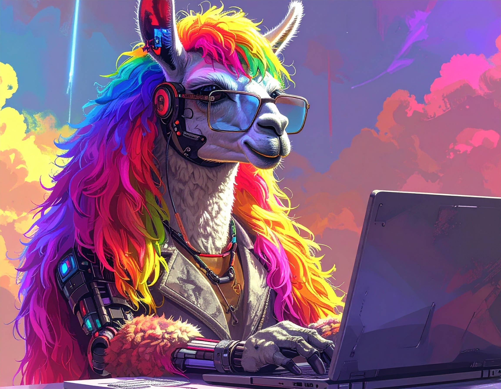

# myLLannotator

Alyssa Lee and Rohan Maddamsetti


## Overview

details go here

## Requirements

- Python==3.12.9+
- DETAILS OF PYTHON LIBRARIES ETC GO HERE.
- R==4.2+ for generating figures and re-running analyses in this paper

## Usage

details go here

### Replicating results in the paper

1. **Create a project directory**:
   ```
   mkdir myLLannotator/
   cd myLLannotator/
   mkdir results
   ```
   
   2. **Download data into the project directory**
   Go to https://zenodo.org/records/18110824 and save the download as a directory `data/` in the project directory.
   3. **Download this github repository**
   Download this github repository as save the download as a directory `src/` in the project directory.
   4. Run the R script `src/simple-ARG-duplication-analysis.R` to generate figures and run the analysis.
   
